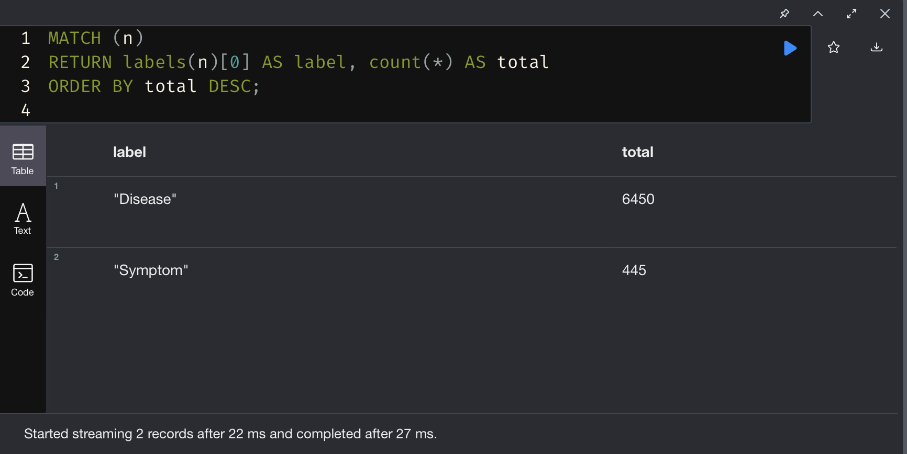
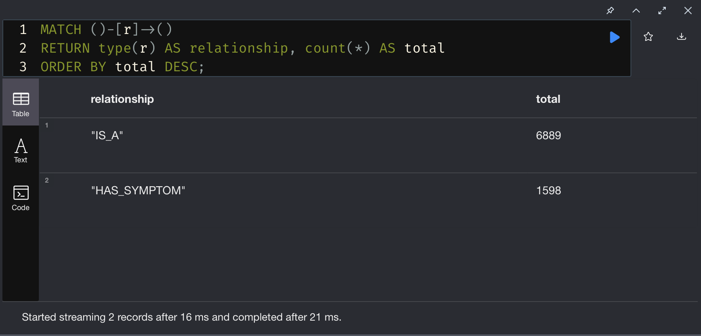
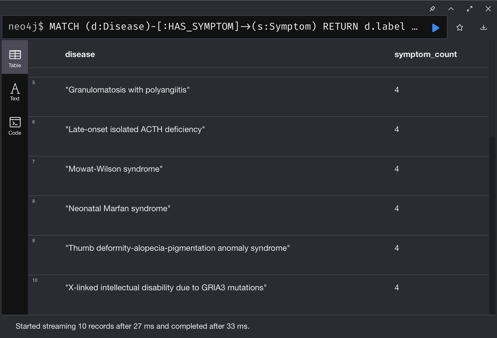
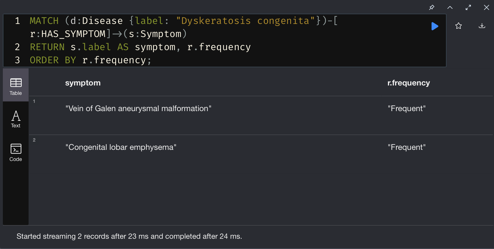
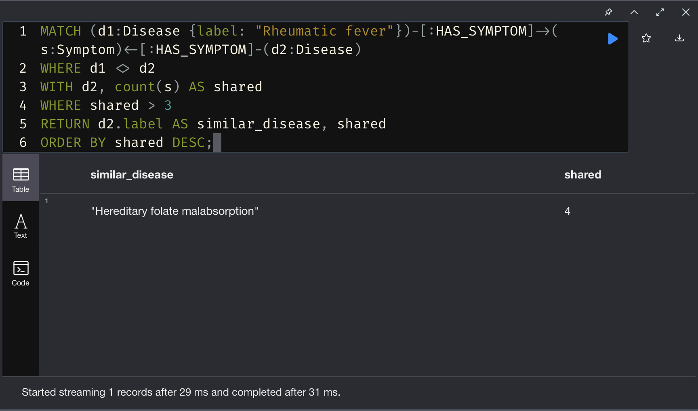
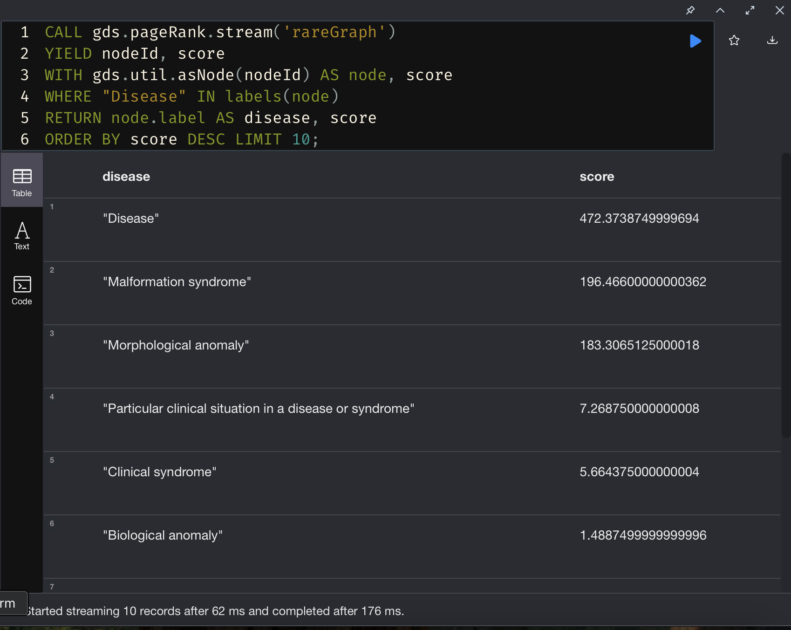

# 🧠 Rare Disease Assistant – Graph-AI Demo

This is a 1-day showcase project (prepared in under 8 hours, like a hackathon :)) that demonstrates how structured semantic knowledge (from the ORDO ontology) can be used for rare disease reasoning through graphs, lightweight NLP, and optional LLM support.

## 🎯 Goal

> “Given a free-text input with patient symptoms, identify likely rare diseases using a knowledge graph derived from ORDO, and explain the reasoning behind the match.”


**Please note**: 
> Some features are not fully finished, and the data itself is **not** completely balanced or production-ready. This is just a foundation for potential further enrichment.
---


## Design Philosophy

This demo was designed to balance:
* Semantic awareness (OWL → Neo4j + documented mapping)
* Graph reasoning (multi-hop traversal, IS_A inference)
* Engineering practice (API, Docker, FastAPI)
* Scalability (LLM layer, RAG-ready architecture)
* See [graph model](graph/graph_model.md) for full ontology mapping details.

### 📈 Future Directions
* RDF-native reasoning layer (GraphDB, Jena)
* Biomedical NER (UMLS / BioPortal)
* Retrieval-Augmented Generation with LLMs
* Auto-deployment
* UI for clinicians - TBD

## 🧠 Summary: Ontologies & Design

This PoC is built around the [ORDO ontology](https://www.ebi.ac.uk/ols4/ontologies/ordo) (Orphanet Rare Disease Ontology), complemented by [HOOM](https://bioportal.bioontology.org/ontologies/HOOM) for symptom frequency.

ORDO provides a strong semantic backbone for modeling rare diseases. I used it to define nodes (`Disease`, `Symptom`) and relations (`HAS_SYMPTOM`, `IS_A`) in a property graph. Symptom frequency from HOOM was encoded numerically to support reasoning with Neo4j GDS.

> “ORDO forms the core; HOOM enriches it with real-world symptom data. Together, they enable structured inference over medical knowledge.”

### Alternative Ontologies that was considered (not used here):
- **HPO** – detailed phenotypic descriptions
- **SNOMED CT** – rich clinical concepts, but restrictive license
- **UMLS** – vast but complex metathesaurus

---

## 🔧 Graph Modeling Principles

- OWL Classes → Node Labels (`Disease`, `Symptom`, optional `Gene`)
- `has_symptom` → `(:Disease)-[:HAS_SYMPTOM]->(:Symptom)`
- `subClassOf` → `IS_A` relations for hierarchy
- Frequency → Property on relationship (`frequency`, `freq_score`)

> “By converting ORDO into a property graph, I enabled flexible queries, traversal, and similarity reasoning, while keeping the model semantically aligned.”

---

## 🔍 Reasoning Use Cases

- Run similarity over symptom graphs to suggest diagnoses
- Use centrality algorithms to identify key symptoms
- Apply PageRank and Louvain to explore structure
- Map patient input to structured data via NLP

> “Graphs allow for dynamic, explainable reasoning – not just static lookup.”

---

## 🚀 Why This Stack?

This is a functional **vertical slice**: from raw text to inference.  
The stack was chosen for clarity, realism, and PoC speed:

| Layer            | Tech Used       | Rationale |
|------------------|-----------------|-----------|
| Ontology         | ORDO + HOOM     | Public, expressive, biomedical focus |
| Graph DB         | Neo4j           | Schema-flexible, Cypher for logic |
| NLP              | spaCy           | Lightweight but extensible |
| API              | FastAPI         | Clean, async-ready, easy to dockerize |
| LLM Integration  | OpenAI GPT-3.5  | Explanation layer, not decision-maker |

> “This demo shows how structured medical knowledge can be made interactive using a graph model and minimal NLP, while keeping the door open for future LLM integration.”

---

## 🧱 Design Priorities

- Simplicity: structure and explainability over deep ML
- Control: manual mapping over black-box models
- Realism: this stack could serve as a backend for real clinical tools
- Extensibility: can grow into RDF/OWL reasoning for futuer RAG pipelines

> “Neo4j isn’t an ontology engine – but it’s great for exploratory reasoning. I mapped OWL logic carefully, showed schema-awareness, and stayed semantically aligned.”

---

## ✅ In Short

This project uses a real medical ontology to build a graph that connects user input to rare disease profiles.  
It’s not just a toy — it’s a reasoning prototype with practical potential.


## 🚀 How to Run

For a readability moved to [other document](how_to_run.md)

## Queries overview (few of them)
As described in running [info document](how_to_run.md) how to play with it. There are few interesting visualtions for our generated dataset as part of built-in queries.

#### Basic stats
It return number of Nodes/Vertices after initial load



#### Return top diseases by number of symptoms
Query:
```cypher
MATCH (d:Disease)-[:HAS_SYMPTOM]->(s:Symptom)
RETURN d.label AS disease, count(s) AS symptom_count
ORDER BY symptom_count DESC
LIMIT 10;
```

[csv results](static/top_by_symptoms.csv)

### Symptoms with frequencies
Symptoms with frequency for a specific disease
Query:
```cypher
MATCH (d:Disease {label: "Dyskeratosis congenita"})-[r:HAS_SYMPTOM]->(s:Symptom)
RETURN s.label AS symptom, r.frequency
ORDER BY r.frequency;
```


### Diseases with sharing symptoms
Diseases that share more than 3 symptoms with a given disease
```cypher
MATCH (d1:Disease {label: "Rheumatic fever"})-[:HAS_SYMPTOM]->(s:Symptom)<-[:HAS_SYMPTOM]-(d2:Disease)
WHERE d1 <> d2
WITH d2, count(s) AS shared
WHERE shared > 3
RETURN d2.label AS similar_disease, shared
ORDER BY shared DESC;
```


> Comments:
So we know below that Rheumatic fever shared 4 symptoms with herediary folate malaborption

### List of most connected symptoms
So with the most number of connected deasese
Query:
```cypher
MATCH (d:Disease)-[:HAS_SYMPTOM]->(s:Symptom)
RETURN s.label AS symptom, count(DISTINCT d) AS disease_count
ORDER BY disease_count DESC
LIMIT 10;
```
[most connected symptoms](static/most_connected.csv)
> Comments:
> This indicated that some of them migh exceed 200 symptoms.

### Page Rank on nodes importance
PageRank algorithm calculates an influence score for each node.
This step helps identify the most connected diseases within the network, indicating their relative importance in the overall structure.
Cypher query:
```cypher
CALL gds.pageRank.stream('rareGraph')
YIELD nodeId, score
WITH gds.util.asNode(nodeId) AS node, score
WHERE "Disease" IN labels(node)
RETURN node.label AS disease, score
ORDER BY score DESC LIMIT 10;
```

[CSV results](static/page_rank.csv)

> Of course due not fully "clean" dataset we have as top just generic term "deasese" which is not surprising, but it proves it works nicely. 

### Similiarity
Disease Similarity Relationships Based on Symptom Profiles.
Node similarity is computed for each pair of diseases that share common symptoms
```cypher
CALL gds.nodeSimilarity.write('rareGraph', {
  writeRelationshipType: 'SIMILAR',
  writeProperty: 'score',
  similarityCutoff: 0.1,
  concurrency: 4
});

MATCH (d:Disease)-[r:SIMILAR]->(d2:Disease)
RETURN d.label AS first_disease, d2.label AS second_disease, r.score
ORDER BY r.score DESC LIMIT 10;

```
[CSV results](static/similarity.csv)

#### Comments:

This answer us that e.g 
`3q27.3 microdeletion syndrome` and `DYRK1A-related intellectual disability syndrome` are likely the same (score > 99,5+) just based only on our graph structure!


### Clustering
In this case there is used Louvain algorithm which is applied to identify naturally occurring clusters (communities) among the disease nodes
Query:
```cypher
CALL gds.louvain.stream('rareGraph')
YIELD nodeId, communityId
WITH communityId, gds.util.asNode(nodeId) AS node
ORDER BY node.label
WITH communityId, collect(node.label) AS diseases, count(*) AS groupSize
RETURN communityId, groupSize, diseases
ORDER BY groupSize ASC
LIMIT 3;
```

[CSV results](static/clustering.csv)


#### Comments
This presented us top 3 clusters of size 12, 49, 61 clustering connected diseases.

### Centrality
To answer which each symptom node lies on the shortest paths between other nodes. A high betweenness score indicates that a given symptom acts as a bridge between different regions of the disease network
```cypher
CALL gds.betweenness.stream('rareGraph')
YIELD nodeId, score
WITH gds.util.asNode(nodeId) AS node, score
WHERE "Symptom" IN labels(node)
RETURN node.label AS symptom, score
ORDER BY score DESC LIMIT 10;
```
[CSV results](static/centrality.csv)

## DEPLOYMENT & VISUALISATIONS
N/A (initially there were plans to incorporate those (e.g with neoj4 bloom and fly.io for deployment) but due time limits it was neglected.

### On author:
[Piotr walkowski](https://github.com/walu2)

email: piotr@deluxe-soft.com