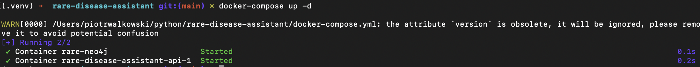

# 🧠 Rare Disease Assistant – Graph-AI Demo

This is a 1-day showcase project that demonstrates how structured semantic knowledge (from ORDO ontology) can be used for rare disease reasoning using graphs, lightweight NLP and optional LLM support.

---

## 🎯 Goal

> “Given a free-text input with patient symptoms, identify likely rare diseases using a knowledge graph derived from ORDO, and explain the reasoning behind the match.”

---

## 🧱 Tech Stack

| Layer       | Tool / Tech           | Purpose                         |
|-------------|------------------------|----------------------------------|
| Graph DB    | Neo4j                  | Stores semantically structured disease/symptom graph |
| Ontology    | ORDO (OWL)             | Medical reference ontology       |
| NLP         | spaCy + keyword mapping| Simple symptom extraction        |
| Reasoning   | Cypher + `IS_A`        | Inference via subclass traversals |
| LLM (opt)   | GPT via OpenAI         | Explanation of results           |
| API         | FastAPI                | Backend interface                |
| Infra       | Docker Compose         | Full local environment           |

---

## 🚀 How to Run

### 1. Clone repo and if needed download newest ordo.owl file

* Make sure you have Docker on your machine.
* Open .env and update `OPENAI_API_KEY` other doesnt need to be changed
You'll need two onthologies which repo is based on:

Download from here -> https://bioportal.bioontology.org/ontologies/ORDO Newest onthology and copy to `data_import/ordo.owl`
Additionally -> https://bioportal.bioontology.org/ontologies/HOOM and choose RDF/XML (because  )
copy those under `data_import` respectively as `ordo.owl` and `owlapi.xrdf` files


* From now theoretically all needd is to run:
`docker-compose up -d   (to remove `docker-compose -r -f; docker-compose down -v`)
`

You should see sth like: 


---
* Neo4j: http://localhost:7474 
* FastAPI docs: http://localhost:8000/docs

For testing purpouses all data-engineering work is already commited but you can do it step by step


> ⚠️ Although Neo4j supports RDF/OWL via the `n10s` plugin, this demo performs manual RDF parsing using `rdflib`, to allow greater control over which elements of the ontology are mapped and exported.

```bash
python3 utils/step_1_extract_ordo.py
python3 utils/step_2_analyse_hoom.py
python3 utils/step_3_extract_hoom.py
python3 utils/step_4_extract_hoom_improver.py
python3 utils/step_5_symptoms_maker.py
``` 

So that we should have ready csv files to import property graph in neo -> `neo4j/import/*.csv` files. Same for `app/nlp/mapping_dict.json` used to NER checkings.

---
Now you can import data to neo4j (this gonna take ~ approx 5 minutes) in a both ways:
- you can call neo4j docker

```docker exec -i rare-neo4j bin/cypher-shell -u neo4j -p password < neo4j/import.cypher```

- alternatively open brower in http://localhost:7474/browser/
and copy/paste content from `/rare-disease-assistant/neo4j/import.cyper`


Now having few data
[IMGS]

---

see [Graph Model](graph/graph_model.md) for details

You can expirement by calling procedures `neo4j/sample_cyphers/*`


There are basically 3 files:
* basic_queries.cypher - just basic queries / demonstrations of cpyher expressions   
* advanced_queries.cypher - more advancesd
* gds_queries.cypher - illustration of reasoning, and graph algorithms (see some [description](neo4j/GDS_interpret.md) on them)

Now can eith copy them step by step to thave controll on evertyhing or just from the browser call by each coomand.
Next you can call from the browser either:
```
:play /guides/intro-guide.adoc
:play /guides/advanced-guide.adoc
:play /guides/gds-guide.adoc
```

### (EXTRA) MANUAL USAGE
If you insist not to use `docker-compose` you can also play by your own
```bash
cd rare-disease-assistant
python -m venv .venv
source .venv/bin/
pip3 install -r requirements.txt
```

For windows:
```
.\.venv\Scripts\activate
```

And call e.g
```bash
python3 python3 utils/step_1_extract_ordo.py
```

### Endpoints

## 4. 📡 API Endpoints (FastAPI)

| Endpoint       | Method | Description                                |
|----------------|--------|--------------------------------------------|
| `/status`      | GET    | Healthcheck – confirms service is running  |
| `/match`       | POST   | Matches input symptoms to diseases          |
| `/summary`     | POST   | Generates LLM-based summary from matches    |

---

### ✅ `GET /status`


Check if the API is alive.


```bash
curl http://localhost:8000/status
```
Response
```json
{
  "status": "ok"
}
```
### `POST /match`

Find diseases matching user-provided symptoms.
```bash
curl -X POST http://localhost:8000/match \
  -H "Content-Type: application/json" \
  -d '{peters anomaly
    "text": "weird cyst, sometimes StErNaL cleft & muscle weakness"
  }'

```
Response
```json
[
  {
    "label": "Friedreich's ataxia",
    "match_score": 3
  },
  {
    "label": "Ataxia-telangiectasia",
    "match_score": 2
  }
]

```

### `POST /summary`

Generate a natural language summary based on graph-derived disease matches.

```bash
curl -X POST http://localhost:8000/summary \
  -H "Content-Type: application/json" \
  -d '{
    "diseases": [
      { "label": "Friedreich ataxia", "score": 3 },
      { "label": "Ataxia-telangiectasia", "score": 2 }
    ],
    "symptoms": ["ataxia", "muscle weakness", "coordination issues"]
  }'

```
Response
```json
{
  "summary": "Based on the provided symptoms, Friedreich's ataxia and Ataxia-telangiectasia are the most likely rare diseases. Both share neurological features such as coordination issues and muscular weakness. Further clinical validation is advised."
}
```
---

### DEPLOYMENT
N/A

---
### 🧠 Design Philosophy

This demo was designed to balance:
* Semantic awareness (OWL → Neo4j + documented mapping)
* Graph reasoning (multi-hop traversal, IS_A inference)
* Engineering practice (API, Docker, FastAPI)
* Scalability (LLM layer, RAG-ready architecture)
* See `graph/graph_model.md` for full ontology mapping details.

### 📈 Future Directions
* RDF-native reasoning layer (GraphDB, Jena)
* Biomedical NER (UMLS / BioPortal)
* Retrieval-Augmented Generation with LLMs
* UI for clinicians (Streamlit prototype)

